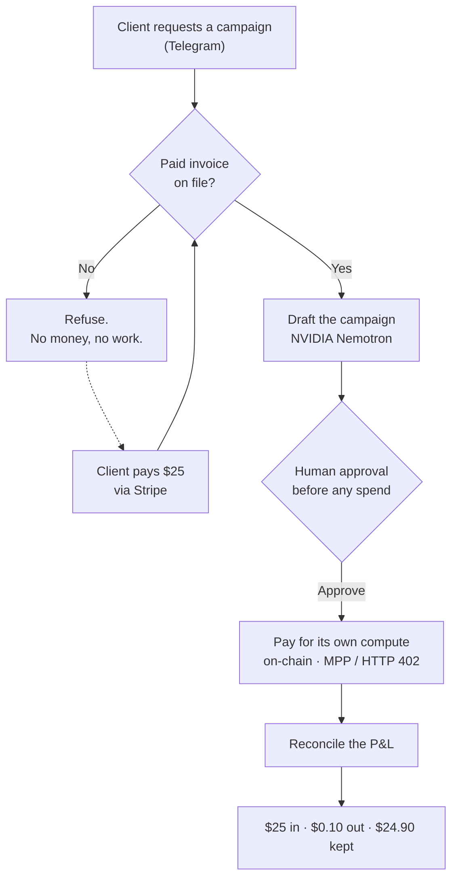

# Howler-Hermes

**An AI employee that won't work until you pay it. Then it pays its own bills and keeps the profit.**

Submission for the **Hermes Agent Accelerated Business Hackathon** · NVIDIA × Stripe × Nous Research

---

## The idea in one paragraph

Most AI agents are a cost center. You pay for the tokens, you pray for the output, the bill lands whether the thing worked or not. Howler runs a P&L instead. It's an AI Head of Content that signs a client, drafts in their voice, funds its own inference, and turns a profit. A human only touches the approval gate.

## Watch it run

▶️ **Demo video:** [PASTE YOUR X DEMO POST LINK HERE]

The full loop, live in Telegram, using a real campaign for Quirkies (@quirkiesnft) as the example.

## The loop: earn → spend → run



1. Client asks Howler to launch a campaign.
2. No paid invoice on file, so it refuses. No money, no work.
3. Client pays $25 through Stripe. The workflow unlocks.
4. It drafts the campaign on NVIDIA Nemotron.
5. Before it spends a cent, it asks the human to approve.
6. It pays for its own compute, on-chain.
7. It reconciles the P&L.

**Receipts from the demo run: $25 in. $0.10 out. $24.90 kept. Every number real.**

## How each hackathon requirement is met

| Requirement | How Howler does it |
|---|---|
| **Earn** | Stripe gates the work. No paid invoice, no draft. Each client is a subscription. |
| **Spend** | Pays per-call for its own inference and data over MPP (HTTP 402 / Machine Payments Protocol). Every instance is a self-funding unit. |
| **Run real operations** | The full provision → draft → bill → reconcile loop runs without a human in the labor, only at the approval gate. |
| **Safety** | Human approval gate on every real-money action. Primary credentials never enter the transcript. One-time credentials are cleaned up after use. |

## Why the output isn't generic AI

The reason a founder would pay for this instead of a $30 tool: the voice is measured, not guessed.

Howler is built on a frequency analysis of 300 real posts. The voice spec is grounded in numbers, not vibes:
- Mean sentence length: **8.6 words**
- Em-dashes per post: **0** (the strongest anti-AI tell, enforced by a post-processor)
- Hook formats ranked by real engagement, not intuition

Most creators guess their voice. This one is measured, then enforced on every draft.

## Architecture

```
Telegram  ──►  Hermes Agent  ──►  Stripe        (earn: gate + bill)
(interface)    (orchestration)     │
                     │             ├─►  NVIDIA Nemotron / NemoClaw   (draft)
                     │             ├─►  MPP on-chain · HTTP 402       (spend: self-funds inference)
                     │             └─►  Ledger                        (run: reconcile P&L)
                     ▼
            Human approval gate  (money-out only)
```

Runtime: serverless (Cloudflare Workers), TypeScript, single-tenant per client.

## Why it's real, not a hackathon mock

Howler is already deployed and drafting live. BabyApe Studio is a real business built around it: a done-for-you AI Head of Content for Web3 founders, with a proposal out to a 59K-follower NFT brand. The hackathon build is the payments layer that lets that business run itself, one self-provisioning, self-funding instance at a time.

## The business — BabyApe Studio

I build founders a private AI Head of Content, tuned to their own voice, live in 14 days. You approve, it ships. It never posts without you. It never touches your keys.

The margin ledger from the loop above is the unit economics of an AI-run content agency: the first content studio that scales without adding humans.

**Want one for your project?** DM 🦍 [@babyape113](https://x.com/babyape113) · [thebabyape.substack.com](https://thebabyape.substack.com)

## Tech stack

Hermes Agent · NVIDIA Nemotron (via NemoClaw) · Stripe · Machine Payments Protocol (on-chain) · Cloudflare Workers · TypeScript

## Source access

This repo is a project showcase. The core implementation is a **private, single-tenant production codebase** (it runs a live business and a client's confidential workflow), so the source is not public. **Judges: full repo access on request — DM [@babyape113](https://x.com/babyape113).**

## Built by

**BabyApe (Jerrg).** Day-1 Bored Ape Yacht Club holder (#3343), Made By Apes #106 (Yuga IP license). In crypto since 2017. Advisor at DeFi App. I build content employees for Web3 founders, and I'm one of them.
